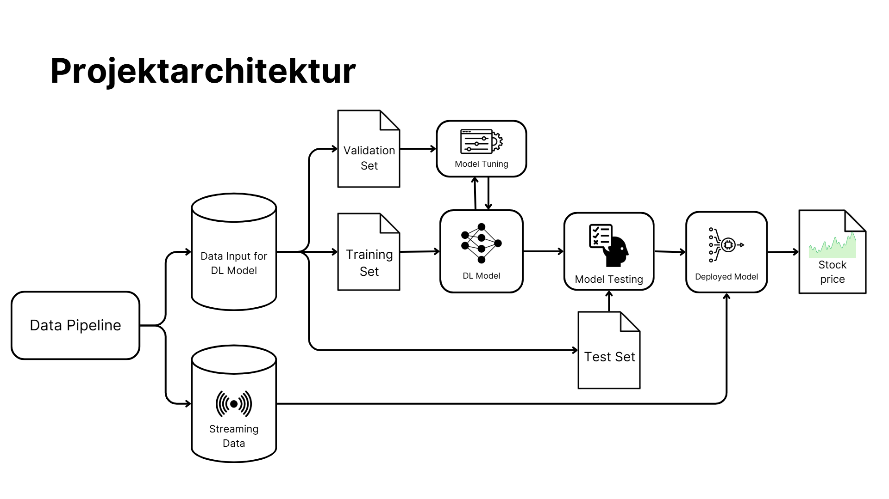
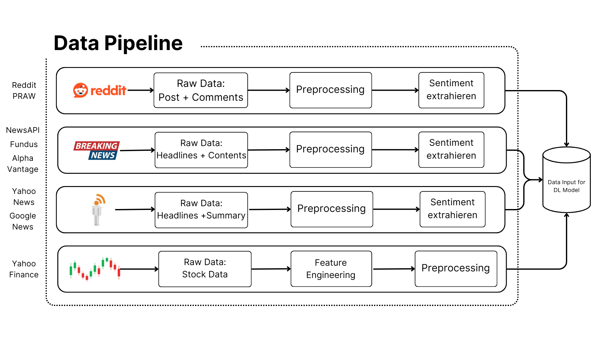
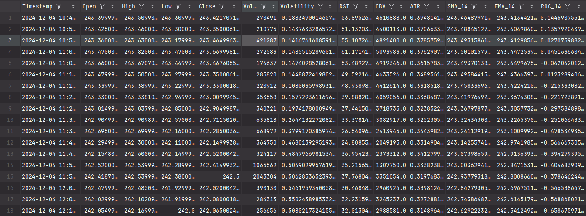
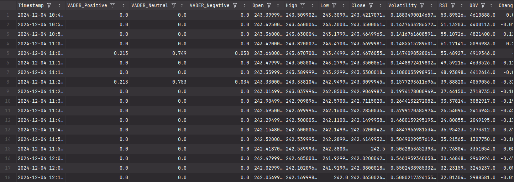
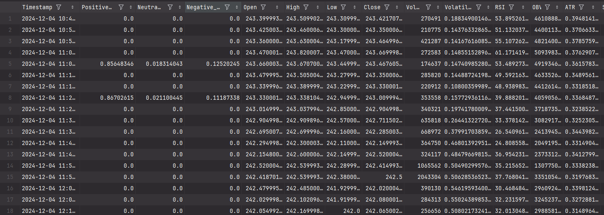
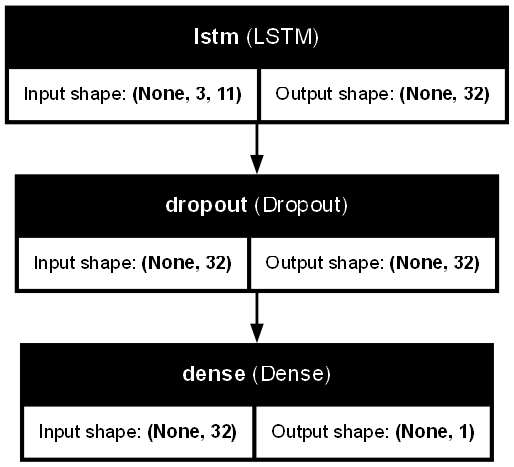
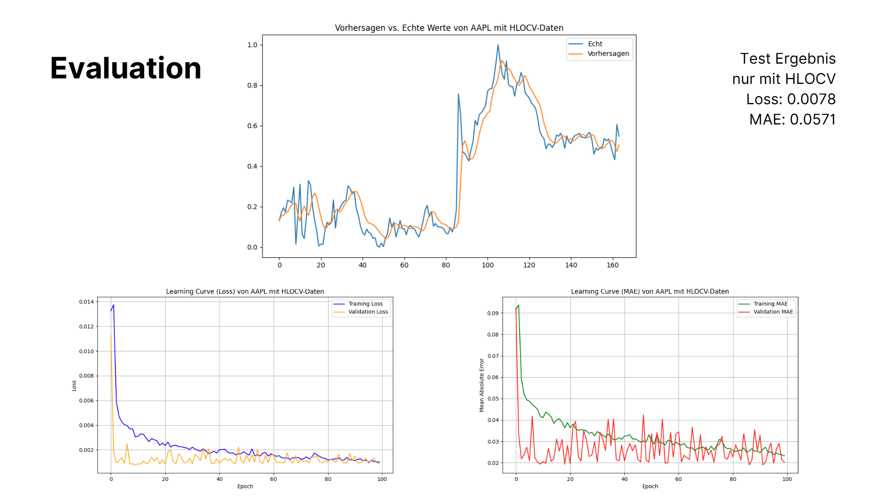
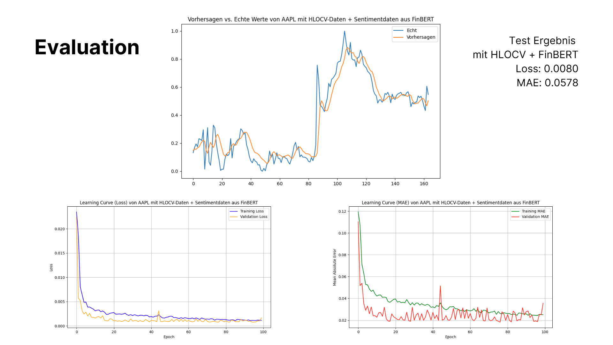
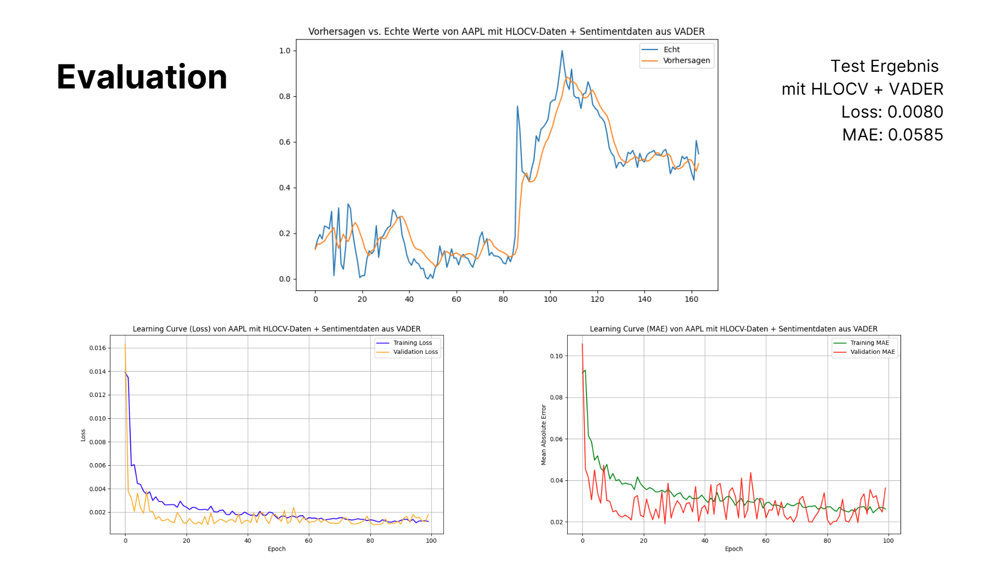

# Deep Learning-Projekt: Aktienkursvorhersage mit Sentimentdaten und historischen Börsendaten

_Dieses Projekt gehört zum Modul _Unternehmenssoftware WS24-25_ des Studiengangs _Wirtschaftsinformatik_ an der _Hochschule für Technik und Wirtschaft Berlin_ und wurde im Zeittraum von _01. Okt. 2024_ bis _15. Jan. 2025_ bearbeitet._

# Inhaltsverzeichnis

- [Einleitung](#einleitung)  
  - [Problemstellung](#problemstellung)  
  - [Experimente](#experimente)  
- [Methodik](#methodik)  
  - [Projektarchitektur](#projektarchitektur)  
  - [Datenbeschreibung](#datenbeschreibung)  
  - [Preprocessing in Datenpipeline](#preprocessing-in-datenpipeline)  
  - [Verwendete Modelle & Modellkonfiguration](#verwendete-modelle--modellkonfiguration)  
- [Ergebnisse](#ergebnisse)  
  - [Evaluierungsmetriken](#evaluierungsmetriken)  
  - [Vergleich der Ergebnisse](#vergleich-der-ergebnisse)  
  - [Analyse der Ergebnisse](#analyse-der-ergebnisse)  
  - [Bekannte Probleme & Einschränkungen](#bekannte-probleme--einschrankungen)  
- [Beitragende](#beitragende)  

# Einleitung 

## **1. Problemstellung** 

Die Sentimentanalyse ist eine Methode zur Extraktion von Meinungen, Emotionen und Stimmungen aus Texten. Sie findet häufig Anwendung in Bereichen wie Kundenservice und Marktanalyse. Zu den gängigen Ansätzen zählen lexikonbasierte Methoden, wie VADER, sowie auf maschinellem Lernen basierende Modelle, wie FinBERT.

Die Analyse von Aktienkursen gehört zu den größten Herausforderungen der Finanzforschung. Aktienkurse werden von einer Vielzahl an Faktoren beeinflusst, darunter wirtschaftliche Indikatoren, politische Ereignisse und das Marktsentiment. Traditionelle Prognosemethoden, wie statistische Modelle, stoßen dabei aufgrund der hohen Volatilität und Komplexität der Märkte oft an ihre Grenzen. In den letzten Jahren hat sich Deep Learning als vielversprechender Ansatz etabliert, da es in der Lage ist, komplexe Muster in großen Datensätzen zu erkennen.

Entscheidungen im Finanzmarkt basieren meist auf objektiven Daten wie Kennzahlen und Kursverläufen. Der Einfluss von Stimmungen und Emotionen wird oft unterschätzt, da diese als subjektiv und schwer messbar gelten. Dennoch besitzen Sentimentdaten großes Potenzial, da sie Marktreaktionen frühzeitig widerspiegeln können – oft bevor sich diese in Kursbewegungen manifestieren. Diese Überlegung bildet die Grundlage unseres Forschungsprojekts.

Aus diesem Kontext ergibt sich die zentrale Forschungfrage: "_**Kann die Kombination von Sentimentdaten aus Marktnachrichten mit HLOCV-Daten die Vorhersage von Aktienkursen verbessern?**_" 

Daraus leiteten wir die folgende Hypothese ab: **_"Die Kombination von Sentiment-Daten mit Börsendaten verbessert die Genauigkeit bei der Vorhersage von Aktienkursen im Vergleich zur alleinigen Nutzung von Börsendaten."_**

## **2. Experimente** 

Zur Überprüfung dieser Hypothese wurden drei Experimente durchgeführt:

* Ein LSTM-Modell, das ausschließlich Börsendaten (HLOCV) nutzt, und dient als Baseline-Modell.
* Ein LSTM-Modell, das HLOCV-Daten und Sentiment-Daten aus VADER nutzt.
* Ein LSTM-Modell, das HLOCV-Daten und Sentiment-Daten aus FinBERT nuzt.

Das Ziel dieser Experimente war es, die Aktienkurse von Apple (AAPL) der nächsten 5 Minuten vorherzusagen. 

# Methodik 
## **1. Projektarchitektur** 

## **2. Datenbeschreibung** 

In diesem Projekt werden 2 Arten von Inputdaten verwendet:

|               |                                     historische Börsendaten                                      |                                                                                                           Sentimentdaten                                                                                                            |
|:--------------|:------------------------------------------------------------------------------------------------:|:------------------------------------------------------------------------------------------------:|
| Eigenschaften |                                     stetige Zeitreihendaten                                      |                                                                                                       Ereignisbasierte Daten                                                                                                        |
| Zeitraum      |                                  04. Dez. 2024 - 06. Jan. 2025                                   |                                                                                                    04. Dez. 2024 - 06. Jan. 2025                                                                                                    |
| Frequenz      | - 5-Minuten-Intervall, täglich von 09:30 bis 16:00 Uhr - Außer an Feiertagen und Wochenenden |                                                                                                        keine feste Frequenz                                                                                                         |
| Inhalt        |                                High, Low, Open, Close und Volume                                 | - Vorverarbeitung: Texte, die sich auf Apple Inc. (AAPL) und deren Produkte beziehen, darunter Nachrichten, Artikel, Social-Media-Posts und Kommentare. - Nachverarbeitung: Sentiment-Scores, extrahiert mit VADER und FinBERT. |
| Quelle        |                                        Yahoo Finance API                                         |                                          Daten stammen aus verschiedenen Plattformen und Publikationen, einschließlich Reddit, Yahoo News, Google News sowie anderer relevanter Publisher.                                          |

## **3. Preprocessing in Datenpipeline** 

Um die Daten für das Modell als Input bereitzustellen, werden sie in mehreren Schritten verarbeitet:

### **3.1 Datenabruf:** 
* Im ersten Schritt der Datenpipeline werden die Daten aus verschiedenen Quellen mithilfe von APIs abgerufen.
* Die abgerufenen Daten werden nach vordefinierten Filtern sortiert und in CSV-Dateien gespeichert, um sie für die weitere Verarbeitung zu sichern.

### **3.2 Datennormalisierung:**
Die Textdaten (Nachrichten, Artikel, Posts, Kommentare,...) werden normalisiert:
* Alle Buchstaben werden in Kleinbuchstaben umgewandelt.
* Satzzeichen und Sonderzeichen werden entfernt.
* Überflüssge Leerzeichen werden bereinigt.

### **3.3 Datentokenisierung:**
* Normalisierte Texte werden in einzelne Wörter (Tokens) zerlegt.
* Stoppwörter entfernt (z. B. "der", "und", "ein").
* Die Wörter auf ihre Grundform reduziert (Lemmatization).

### _**Diese Schritte sind notwendig, da VADER diese Verarbeitung nicht automatisch durchführt, im Gegensatz zu FinBERT.**_

### **3.4 Sentiment-Scoring:**
* Die bereinigten Texte werden mit den Algorithmen von VADER und FinBERT analysiert.
* Für jeden Text wird ein Sentiment-Score berechnet, der die Wahrscheinlichkeit eines positiven, negativen oder neutralen Sentiments angibt.
* Da es sich bei den Textdaten um ereignisbasierte Daten handelt, entstehen Lücken, wenn diese in eine Zeitreihe überführt werden. Diese Lücken werden mit 0 aufgefüllt.

### **3.5 Datensegmentierung & -verschiebung:**
* Die Börsendaten (HLOCV) von Yahoo Finance liegen in 5-Minuten-Intervallen vor.
* Um eine Konsistenz zwischen den Börsen- und Sentimentdaten zu gewährleisten:
  * Werden die Sentimentdaten in 5-Minuten-Intervalle gruppiert.
  * Für jedes Intervall wird der Durchschnitt der Sentiment-Scores berechnet, sodass ein repräsentativer Wert für jedes Intervall entsteht.
  * Die Sentimentdaten werden um 5 Minuten nach vorne verschoben, um sicherzustellen, dass sie auf den zeitlich nachfolgenden Aktienkurs Einfluss nehmen und nicht umgekehrt.

### **3.6 Feature Engineering:**
* Für die HLOCV-Daten werden zusätzliche technische Indikatoren berechnet, z.B.: Volatilität, RSI, OBV, ATR, SMA, ROC
* Diese Indikatoren helfen dabei, die Vorhersageleistung des Modells zu verbessern.

### **3.7 Weitere Schritte:**
Sie werden noch durch einige Schritte wie:
* Datenteilung: Nach Trainingset, Validationtest, Testset teilen (7:2:1)
* MinMax-Skalierung
* in Sequenzen teilen: window = 3

## **4. Verwendete Modelle & Modellkonfiguration** 

Im Rahmen des Projekts wurde ein Long Short-Term Memory (LSTM)-Modell eingesetzt, um die Vorhersage von Aktienkursen basierend auf Börsen- und Sentimentdaten zu ermöglichen.

Zu Beginn wurden mehrere Modellvarianten mit unterschiedlichen Parametern gestestet. Allerdings zeigte sich, dass eine einfachere Modellstruktur aufgrund der begrenzten Datenmenge bessere Ergebnisse liefert und die Overfitting verhindert.

Die folgende Konfiguration wurde als optimal für die Vorhersage identifiziert: 

|   Parameter   |          Werte          |
|:-------------:|:-----------------------:|
| LSTM-Schicht  |       32 Neuronen       |
| Dropout-Rate  |           20%           |
|  Dense Layer  |            1            |
|   Optimizer   |          Adam           |
|   Lernrate    |         0.0005          |
| Loss-Funktion |   Mean Squared Error    |
|  Batchgröße   |           16            |
|  Epochenzahl  | 100 mit Early Stopping  |

* Es wurden verschiedene Kombinationen von Hyperparametern getestet, darunter: Anzahl der LSTM-Schichten, -Neuronen, Dropout-Rate, Regularization, Optimizer, Lernrate, Batchgröße, Window von Sequenzen, Epochenzahl...

* Das finale Modell wurde basierend auf der Performance auf einem Validierungsdatensatz ausgewählt. (validation_loss)

# Ergebnisse 
## **1. Evaluierungsmetriken** 
Zur Bewertung der Modellleistung wurden folgende Metriken verwendet:
* **Loss**: Misst die Differenz zwischen den vorhergesagten und tatsächlichen Werten während des Trainings.
* **MAE**: Bewertet die durchschnittliche Abweichung der Vorhersagen von den tatsächlichen Werten, unabhängig vom Vorzeichen.

## **2. Vergleich der Ergebnisse** 
Die Modelle wurden in drei Experimenten verglichen:

Die Ergebnisse zeigen, dass es nur geringe Unterschiede in der Vorhersageleistung zwischen den drei Experimenten gibt:
* Das Modell mit **HLOCV-Daten** erzielte die besten Ergebnisse und wies den niedrigsten MAE- und Loss-Wert auf.
* Die Modelle mit **Sentimentdaten** schnitten schlechter ab, wobei das Modell mit VADER-Sentimentdaten die schlechteste Leistung zeigte.

## **3.Analyse der Ergebnisse** 
Die Experimente mit Sentimentdaten konnten die Modellleistung nicht verbessern. Das Modell, das ausschließlich mit HLOCV-Daten trainiert wurde, lieferte die präzisesten Vorhersagen.
Daher wird die Hypothese **nicht unterstützt**: Die Integration von Sentimentdaten verbessert nicht die Genauigkeit bei der Vorhersage von Aktienkursen.

## **4. Bekannte Probleme & Einschränkungen** 
Da in diesem Projekt nur kostenfreie API-Versionen verwendet wurden, traten einige Einschränkungen und Herausforderungen auf:

| Probleme | Erklärung                                                                                                                                                                                                                                                                                                                                  |
|:---------|:-------------------------------------------------------------------------------------------------------------------------------------------------------------------------------------------------------------------------------------------------------------------------------------------------------------------------------------------|
|   Qualitative Datenprobleme       | Die Filtergenauigkeit ist nicht zu 100 % gewährleistet. Beispielsweise: - Manche Nachrichten sind nicht direkt relevant für Apple oder dessen Produkte. - Einige Nachrichten stammen außerhalb des gewünschten Zeitraums.                                                                                                          |
| Quantitative Datenprobleme | Die Datenmenge war begrenzt durch API-Beschränkungen, z. B.: - Nur die letzten 100 Nachrichten konnten abgerufen werden. - Nachrichten vom gleichen Tag, insbesondere während Handelszeiten, waren oft unvollständig.                                                                                                              |
|    Dateninkonsistenz      | Einige APIs lieferten vollständige Artikel, andere nur Titel. Dies führte zu uneinheitlichen Eingabedaten.                                                                                                                                                                                                                                 |
| Datenredundanz    | Gleiche Inhalte wurden von unterschiedlichen Publishern veröffentlicht, oft mit variierenden Titeln, was zu redundanten Daten führte.                                                                                                                                                                                                                                                                                                                                           |

Alle oben genannten Probleme könnten durch den Einsatz von kostenpflichtigen APIs weitgehend gelöst werden, da diese in der Regel größere Datenmengen, bessere Filtermöglichkeiten und konsistentere Ergebnisse bieten.

# Beitragende 

|       Name        |  Matrikelnummer  |                        Github                        |
|:-----------------:|:----------------:|:----------------------------------------------------:|
|  Hai Hung Nguyen  |      577612      | [@hungnguyen5298](https://github.com/hungnguyen5298) |
|   Ha Lan Nguyen   |      584521      |    [@NguyenHaLan](https://github.com/NguyenHaLan)    |
